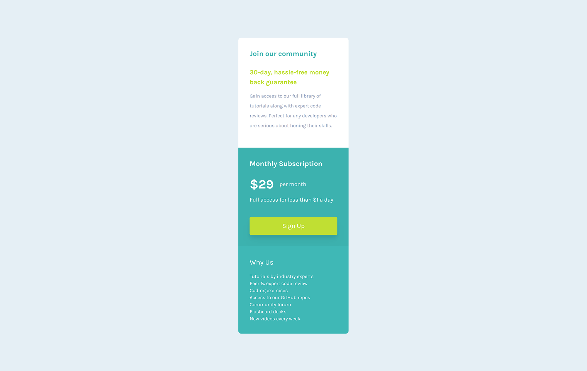

# Frontend Mentor - Single price grid component solution

This is a solution to the [Single price grid component challenge on Frontend Mentor](https://www.frontendmentor.io/challenges/single-price-grid-component-5ce41129d0ff452fec5abbbc).

## Table of contents

- [Overview](#overview)
  - [The challenge](#the-challenge)
  - [Screenshot](#screenshot)
  - [Links](#links)
- [My process](#my-process)
  - [Built with](#built-with)
  - [What I learned](#what-i-learned)
  - [Continued development](#continued-development)
  - [Useful resources](#useful-resources)
- [Author](#author)

## Overview

### The challenge

Users should be able to:

- View the optimal layout for the component depending on their device's screen size

### Screenshot




### Links

- Solution URL: [Add solution URL here](https://github.com/m00nta/single-price-grid-component-master)
- Live Site URL: [Add live site URL here](https://m00nta.github.io/single-price-grid-component-master/)

## My process

### Built with

- Semantic HTML5 markup
- [Tailwind CSS Framework](https://tailwindcss.com/) - For styles
- Flexbox
- CSS Grid

### What I learned

I learned how to setup the tailwind CLI framework then how to work with different Tailwind classes and utilities and work with responsive utilities. Lastly I learned how to customize the config file so I can add custom colors fonts and responsive units.

```js
module.exports = {
  content: ['./*.{html,js}'],
  theme: {
    screens: {
      '2xl': { max: '1535px' },
      // => @media (max-width: 1535px) { ... }

      xl: { max: '1279px' },
      // => @media (max-width: 1279px) { ... }

      lg: { max: '1024px' },
      // => @media (max-width: 1023px) { ... }

      md: { max: '767px' },
      // => @media (max-width: 767px) { ... }

      sm: { max: '639px' },
      // => @media (max-width: 639px) { ... }
    },
    fontFamily: {
      karla: ['Karla', 'sans-serif'],
    },
    extend: {
      colors: {
        'Jungle-Green': '#2ab2af',
        'Black-Squeeze': '#e5eff5',
        'Gull-Gray': '#98a6bd',
        'Pear-main': '#c0df34',
      },
    },
  },
  plugins: [],
};
```

### Continued development

I want to continue working with TailwindCSS Framework and learn how to customize it to the fullist, also how I can manipulate the DOM with it using JavaScript.

### Useful resources

- [TailwindCSS Documentation](https://tailwindcss.com/docs/installation) - This helped me get setup quickly with Tailwind and there is hundreds of pages, However it's easy to get the information by searching css properties.

## Author

- Twitter - [@m00nta](https://twitter.com/m00nta)
- Frontend Mentor - [@m00nta](https://www.frontendmentor.io/profile/m00nta)
